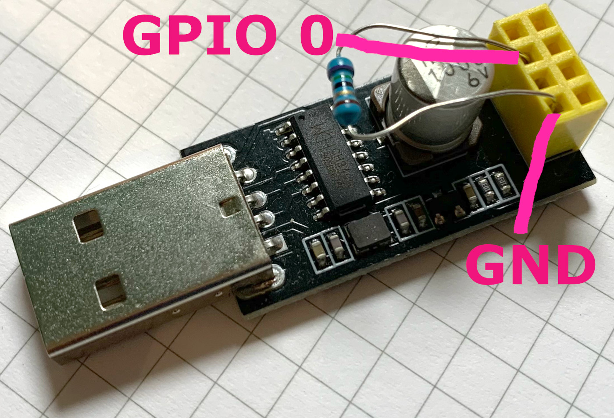

# esp8266.door-opener

## What's this project about?
_TODO: Describe purpose_

## Usage

### Setup
Please refer to section [Hardware Setup](#hardware-setup) to learn how to wire up things. Section [Development](#development) will tell you how to compile the sources and upload it to your ESP-01S board. Of course you may use this source with different hardware.

### First Start
_TODO: Describe behavior after initial start_

## Hardware Setup
### Schematic
_TODO: Schematic for wiring_

### Used Parts
_TODO: List all parts used_

### Flashing the ESP-01S with the Arduino IDE
*Please note:* this documentation tells you how to realize this project with a particular hardware setup. However, you might choose to employ different parts, e.g. one of the other great ESP8266 boards or different relay modules. In most cases, I hope, you might just need to adjust some parameters.

1. In *Preferences* add the Boards Manager URL:
`http://arduino.esp8266.com/stable/package_esp8266com_index.json`

2. Open menu *Tools* and sub-menu *Board: "xyz"* (xyz being some board's name) to find the *Boards Manager* menu item. Click it to open the boards manager.

3. Use the search bar to enter "esp8266" and install the "esp8266 by ESP8266 Community" drivers in a current version (see used versions in this document).

4. Use the following settings:
| Setting         	| Value / Option             	|
|-----------------	|----------------------------	|
| Flash Frequency 	| 40 MHz                     	|
| Flash Mode      	| DIO                        	|
| Reset Mode      	| no dtr (aka ck)            	|
| Upload Speed    	| 115200                     	|
| Flash Size      	| 512KB (FS:64KB OTA:~214KB) 	|
| CPU Frequency   	| 80 MHz                     	|
| Debug Port        | Disabled                   	|
| Debug Level       | none                      	|
| Port              | *please check, which port is added, when the programmer board is plugged in* |

*Please note:* of course, you can turn on debugging facilities when needed during development.

5. In order to switch the ESP-01S into flash mode you need to pull-down GPIO 0 to GND. This can be done with an 2-10kΩ resistor that you put into the header connector before you plug the ESP-01S on top.

## Development

### Backlog
For the beginning all open to-dos are listed here:
* ESP01-S programmieren und Einstellungen dokumentieren
* GitHub-Projekt anlegen
* Als Nutzer möchte ich, dass das Gerät sich automatisch in mein Wifi einwählt, sodass ich keine manuelle Konfiguration machen muss. (Wifi-Daten und Passwords.h auf git-ignore)
* Als Nutzer möchte ich, eine Webseite mit IP-Adresse anzeigt bekommen.
* Als Nutzer möchte ich, dass die Webseite einen Knopf anzeigt, den ich drücken kann, um die Onboard-LED ein und auszuschalten.
* Als Nutzer möchte ich, dass der Knopf auf der Webseite beim Drücken für 2 Sekunden gedrückt und deaktiviert bleibt.
* Als Nutzer möchte ich, dass ein statisches Passwort eingeben muss, damit sich beim Drücken des Kopfes die Tür öffnet.
* Als Nutzer möchte ich, dass das Gerät sich stündlich neu startet, sodass verloren gegangene Wifi-Verbindungen wiederhergestellt werden.
* Als Nutzer möchte ich, dass ich ein temporäres Passwort per Pushnachricht anfordern kann, dass dann 60 Sekunden lang als Passwort zum Öffnen verwendet werden kann.

#### Security
_TODO: Lets spend some thoughts on potential attack vectors_

### Used Tooling
* Arduino IDE, 2.0.0-beta9, https://www.arduino.cc/en/Main/Software

### Library dependencies
| Library                                                                      	| Version                    	| Source                                         	| Used for                                                                                 	|
|------------------------------------------------------------------------------	|----------------------------	|------------------------------------------------	|------------------------------------------------------------------------------------------	|
| Arduino core for ESP8266 WiFi chip  (ESP8266WiFi, ESP8266WebServer, WiFiUdp) 	| 3.0.1                      	| https://github.com/esp8266/Arduino             	| Basic WiFi functionality, web server for serving HTTP REST, UDP for NTP requests.        	|

### Design considerations
* ...

## Links / References
* ...
